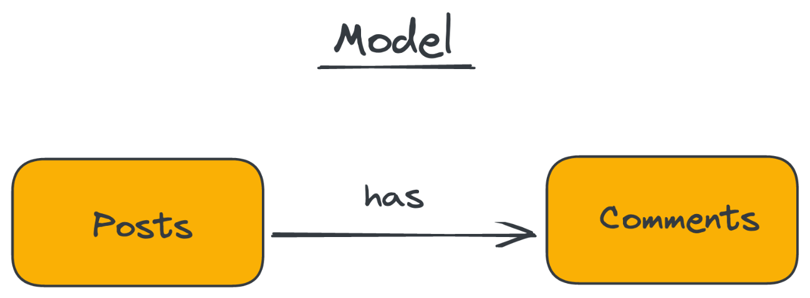
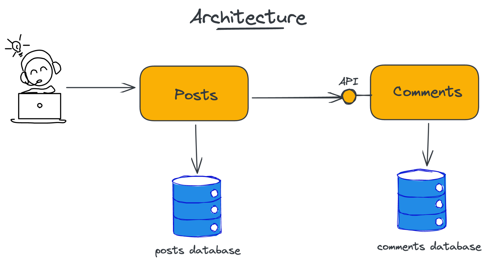

# reactive-microservices-workshop

> Copyright © 2021 [Aleix Morgadas](https://aleixmorgadas.dev/) - Licenced under [CC BY-SA 4.0](https://creativecommons.org/licenses/by-sa/4.0/) 

A project to learn about Reactive Microservices experimenting with architectures and patterns

## Model

The model is quite simple, you will find it too simple to be split between two Services. Yet, I consider this situation
happens more often that we might be aware of.

The idea of having a simple model is to focus on __Learing about Reactive Microservices__.

## Simplistic Architecture

This is the first step of any microservice arhictecture, having two services. Then, a situation that happens often is
that one talk to the other.

Here, we assume (obviously they don't :joy:) that `Posts` and `Comments` are enough big boundaries to be in their own
serive.

